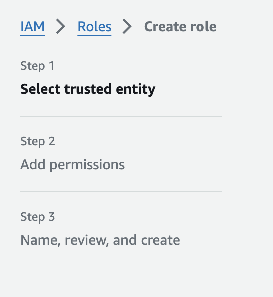

# Trust Policy vs managed policy in AWS

## what is this aws policy mean?

```JSON
{
    "Version": "2012-10-17",
    "Statement": [
        {
            "Effect": "Allow",
            "Principal": {
                "Service": "lambda.amazonaws.com"
            },
            "Action": "sts:AssumeRole"
        }
    ]
}
```

- a type of **trust policy** used for AWS Identity and Access Management (IAM) roles, specifically designed for integration with AWS Lambda.

Here's a breakdown of its components:

- Version: "2012-10-17" specifies the version of the policy language that you're using. AWS recommends using this version for all policies.

- Statement: Contains an array of individual statements (in this case, just one). Each statement defines a specific permission.

  - `Effect`: "**Allow**" indicates that the permission granted by the statement is to allow some actions. It's the opposite of "**Deny**", which would prevent certain actions.

  - `Principal`: Specifies the AWS service or user **who** is allowed or denied access to the resource. In this case, "Service": "lambda.amazonaws.com" means the policy is specifically allowing <span style="color: yellow">AWS Lambda service</span> to perform actions defined in the policy.

  - `Action`: Specifies the particular action or actions that the principal can or cannot perform. "sts:AssumeRole" means that the <span style="color: yellow">AWS Lambda service is allowed to assume an IAM role</span>. The sts:AssumeRole action is part of AWS Security Token Service (STS) and allows one AWS service to adopt a role with specific permissions.

This policy is typically attached to an IAM role to define who can assume the role (in this case, AWS Lambda). By allowing the sts:AssumeRole action for the lambda.amazonaws.com service, it enables AWS Lambda functions to assume the IAM role and gain the permissions assigned to that role. This is crucial for scenarios where your Lambda function needs to access other AWS resources and perform actions within your AWS environment according to the permissions defined in the role.

## Is this policy similar to AWSLambdaFullAccess?

No, the policy you've shown is not similar to AWSLambdaFullAccess.

The policy you've shared is a `trust policy` for an IAM role, specifically allowing the AWS Lambda service (lambda.amazonaws.com) to assume that role through the sts:AssumeRole action. This type of policy <strong style="color:red">does not grant permissions to access AWS resources directly</strong>. Instead, it defines a trust relationship allowing AWS Lambda to adopt the role and gain its assigned permissions.

On the other hand, AWSLambdaFullAccess is a `managed policy` provided by AWS that grants full access to AWS Lambda. This means it provides permissions to create, update, and delete Lambda functions, manage function permissions, and perform other Lambda-related tasks across the AWS environment. It's designed to be attached to users, groups, or roles within AWS IAM to grant them comprehensive permissions to manage Lambda services.

In summary:

The policy you've provided is a trust policy that enables a service (AWS Lambda) to assume a particular IAM role.
AWSLambdaFullAccess is a permissions policy that grants extensive rights to manage and operate AWS Lambda functions and related resources.
They serve different purposes within the AWS security and access control model.

## Trust Policy vs Managed Policy

In AWS, trust policies and managed policies serve different but complementary purposes in managing access and permissions within your AWS environment.

- `Trust Policies` are attached to IAM roles and define which principals (users, applications, or services) are allowed to assume the role. These policies essentially <strong style="color:aqua">establish a trust relationship between the entity</strong> (such as an AWS service like Lambda or an external user) <strong style="color:aqua">and the role, specifying who can assume the role</strong>. For example, a trust policy allows a Lambda function to assume a role so that it can perform actions permitted by the role's permissions on behalf of the user​​.

- `Managed Policies`, on the other hand, are standalone policies that you can attach to multiple IAM users, groups, or roles within AWS. These policies <strong style="color:orange">define permissions that specify what actions the principals can perform and on which resources</strong>. Managed policies can be AWS managed (created and managed by AWS) or customer managed (created and managed by you). The use of managed policies simplifies permission management, as a single managed policy can apply to multiple users, groups, or roles​​.

In plain language, think of:

- `Trust policies` as a way to open the door for certain entities to "wear" a role and gain its abilities, like <span style="color:pink">allowing a friend to borrow your badge to access a restricted area</span>.
- `Managed policies`, meanwhile, outline exactly what actions can be taken, akin to defining <span style="color:lightblue">what your friend can do once inside the restricted area with your badge</span>.

The key difference is that trust policies focus on establishing trust and granting the ability to assume a role, while managed policies define the specific actions that can be taken by the role or attached entities.

## In the context of Trust Policy, what do you mean, `assume a IAM role`?

<strong style="color:yellow">To "assume an IAM role" in AWS (Amazon Web Services)</strong> means that an entity (such as an AWS service like Lambda, a user, or an application) <span style="font-style:italic; color:lightgreen">temporarily takes on the permissions that the IAM role has been granted</span>, allowing it to perform actions defined by that role within AWS. This is a security feature that enables granular access control and ensures that principles operate under the principle of least privilege, accessing only the resources they need to perform their tasks.

When an AWS service like Lambda "assumes a role," it essentially steps into the shoes of that role, <span style="color:lightgreen">inheriting all the permissions the role possesses</span>. This is crucial for tasks that require access to other AWS resources. For instance, if a Lambda function needs to read from an S3 bucket or write to a DynamoDB table, it would need the permissions to do so. By assuming a role that has these permissions, the Lambda function can carry out its tasks without each service or user needing to be individually granted permissions, thus streamlining the process and enhancing security by keeping permissions management centralized.

This mechanism supports AWS's secure environment, allowing for temporary, limited access based on the role's permissions, and it can be revoked or changed as needed without directly modifying the service or user's inherent permissions.

It's important to note that the <strong style="color:red">trust policy (Step 1) does not specify the permissions that the role grants once assumed. Those permissions are defined in the role's permissions policy (Step2)</strong>. The trust policy simply controls who can assume the role and under what conditions


