# Workshop [Invoice Agent Implementation Base on AWS Bedrock Agent](https://catalog.us-east-1.prod.workshops.aws/workshops/180cd73a-ccaf-4ade-9e5d-cf964c637638/en-US/0-0-introduction)

## This is part 1 of the workshop

This is an overall architecture design based on AWS services. In this design, there are six main core components: Bedrock Agent, Bedrock Knowledge Base, S3, Lambda, OpenSearch and SES.
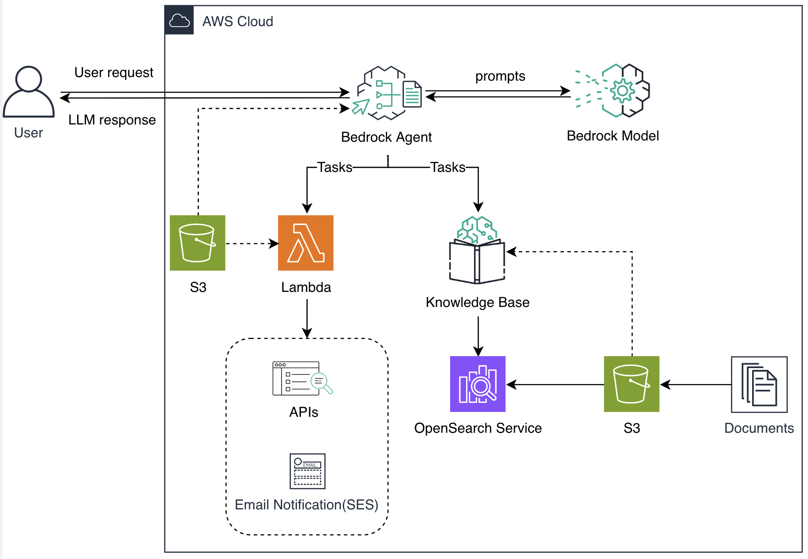
The overall flowchart of the Invoice Agent is shown below:
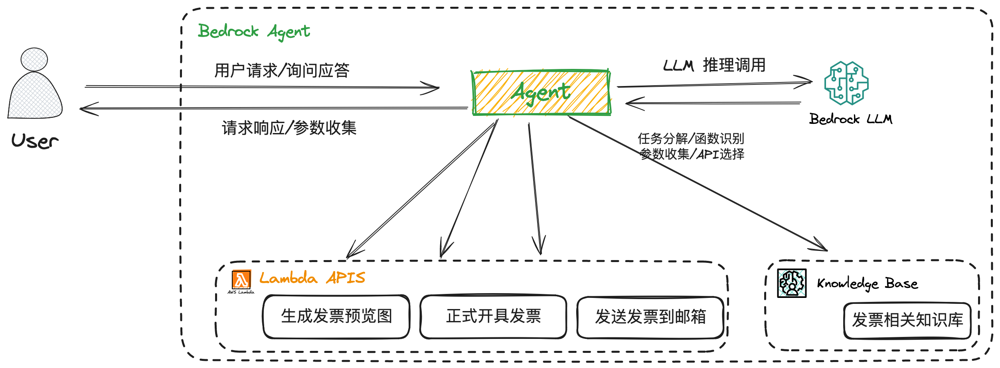
User send a request to Agent. Thennnnn Agent analyzes user's question and decides whether it needs to ask the user for more information, calls APIs or queries the Knowledge Base to generate answers.

## Code Repository

[here](https://github.com/xiaoqunnaws/bedrock_agent_knowledege_base)

## Steps

### Prerequisites

Must be in the us-east-1 region. (Sadly)

1. [Apply Bedrock model access](https://us-east-1.console.aws.amazon.com/bedrock/home?region=us-east-1#/modelaccess).
   models needed: "Titan Embeddings G1 - Text", "Claude", and "Claude Instant".
1. [Set up SES email verification](https://us-east-1.console.aws.amazon.com/ses/home?region=us-east-1#/get-set-up). Create identity and verify it if you haven't already.
1. [Upload files to S3](https://s3.console.aws.amazon.com/s3/buckets?region=us-east-1&bucketType=general).

All files can be found in the repo under `bedrock_agent_konwledege_base/conf` or root folder.

- Create one bucket, "invoice-kb-demo-default-{your_accout_id}", to store Knowledge Base documents, i.e, invoice-kb-demo-default-238857128672.

  - Upload `/conf/china_invoice_policy.pdf`, the policy document used to build the Knowledge Base, to the Knowledge Base S3 bucket.

- Create another bucket, "invocie-agent-{your_accout_id}", to store Agent related files, i.e, invocie-agent-238857128672.

  - Upload API schema and packaged lambda layer zip file.

    `Lambda API schema`: invoice_service_schema.json

    `demo python dependencies + lambda layer`: invoice_lambda_layer.zip

  - Upload invoice configuration files.

    `PDF fonts`: /conf/DejaVuSansCondensed.ttf

    `Trade taxonomy`: /conf/product_code_name_map.txt

### Create Knowledge Base

A knowledge base reads data from
your Amazon S3 bucket, splits it into smaller chunks, generates vector embeddings, and stores the
embeddings in a vector index that you provide.

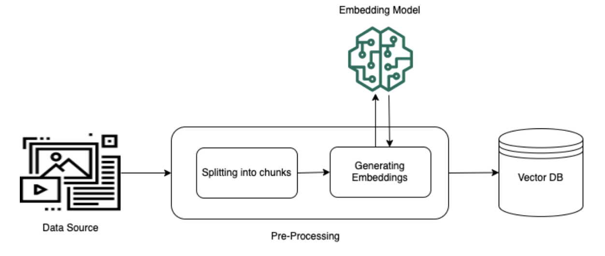

Go to [bedrock knowledge base](https://us-east-1.console.aws.amazon.com/bedrock/home?region=us-east-1#/knowledge-bases)

1. **Create knowledge base**

   - Knowledge base name: `china-invoice-policy`
   - Knowledge base description: The Fapiao system is a cornerstone of China's tax policy. Understanding and complying with its requirements ensures financial accuracy, and avoid legal issues related to tax reporting and compliance.
   - Create and use a new service role: `AmazonBedrockExecutionRoleForKnowledgeBase_qmm92`

2. **Set up data source**

   - Data source name: `china-invoice-pdf-data-source`
   - S3 URI: `s3://invoice-kb-demo-default-905418072341/china_invoice_policy.pdf`
     (choose the pdf file)

3. **Select embeddings model AND Configure vector store**

   - Embeddings model: `Titan Embeddings G1 - Text`
   - Quick create a new vector store - Recommended
     (We will create an Amazon OpenSearch Serverless vector store on your behalf.)

4. **Review and create**

   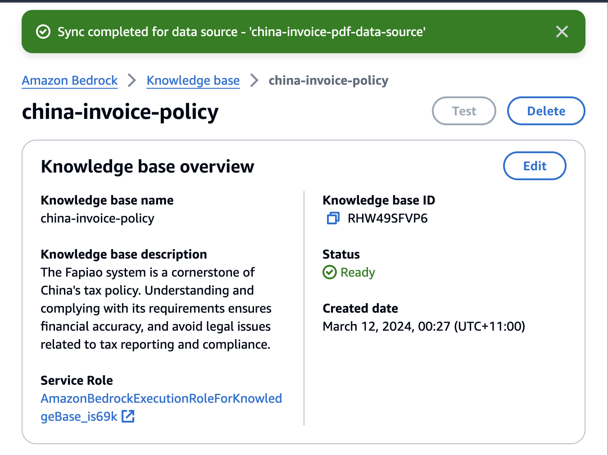

5. **Sync data source to KB**
   This will automatically chunk documents, embedding chunks, and store indexes in OpenSearch collection.
   In the Amazon OpenSearch Service Serverless console, you can see the collection and indexes.
   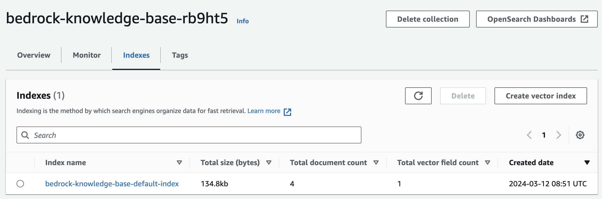

#### Issue regrading the knowledge base creation:

Most of the issues are related to the permission of the user (IAM). If you don't want to dig into the details, probably just give the permission of `AdministratorAccess` to the user.

Check this [doc](https://docs.aws.amazon.com/bedrock/latest/userguide/knowledge-base-create.html) before creating the knowledge base.

1. **Knowledge Base creation with a root user is not supported.**
   

Solution:

- Go to IAM > Users > Create user
- User name: `admin`. Must `tick` Provide user access to the AWS Management Console - optional
  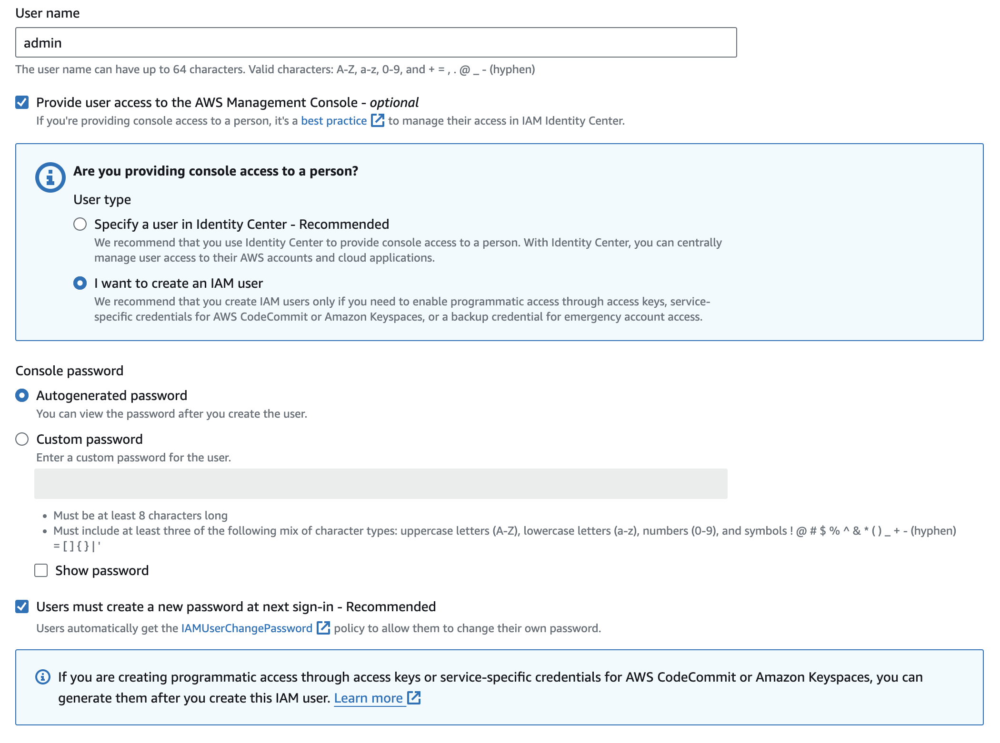
- Set permissions
  Attach policies directly:

  - AmazonBedrockFullAccess
  - AmazonS3FullAccess
  - AWSLambda_FullAccess
  - AmazonSESFullAccess
  - AmazonOpenSearchServiceFullAccess
  - IAMAccessAnalyzerFullAccess (create trust policy for the Lambda service)

  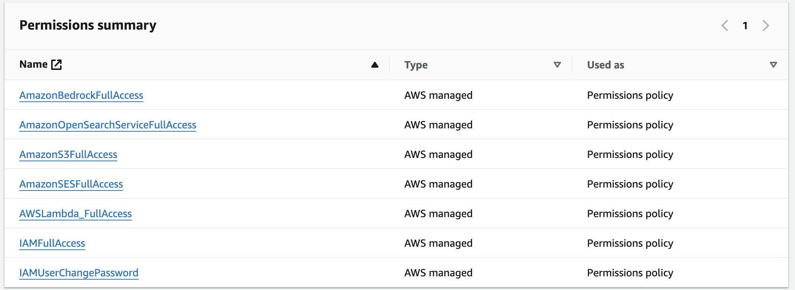

- Create user
  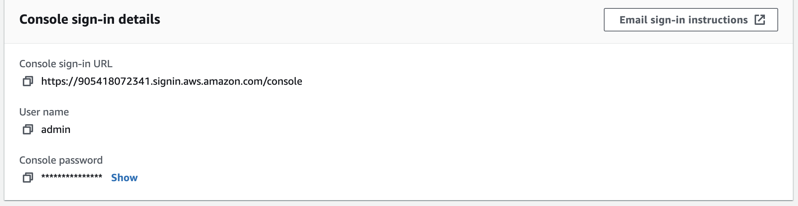

- Logout of the root user and login with the new user.
  Change the password.

2. **Failed to create the Amazon Opensearch Serverless collection.**
   

   looks like the `AmazonOpenSearchServiceFullAccess` is not enough.

   ```JSON
   {
    "Version": "2012-10-17",
    "Statement": [
        {
            "Effect": "Allow",
            "Action": [
                "es:*"
            ],
            "Resource": "*"
        }
    ]
   }
   ```

   Need to at least add this policy to the user.

   ```JSON
   {
    "Version": "2012-10-17",
    "Statement": [
        {
            "Effect": "Allow",
            "Action": "aoss:CreateSecurityPolicy",
            "Resource": "*"
        }
    ]
   }
   ```

   Decide to follow this [tutorial](https://docs.aws.amazon.com/opensearch-service/latest/developerguide/gsg-serverless.html) to know basics about the security in Amazon OpenSearch Service (aoss)

   Go to Root user and add policy.

   finally, created an inline policy named `bedrockCreateKnowledgeBase` attached to the user:

   ```JSON
   {
   	"Version": "2012-10-17",
   	"Statement": [
   		{
   			"Sid": "VisualEditor0",
   			"Effect": "Allow",
   			"Action": [
   				"aoss:BatchGetCollection",
   				"aoss:ListSecurityPolicies",
   				"aoss:CreateAccessPolicy",
   				"aoss:GetAccessPolicy",
   				"aoss:CreateSecurityPolicy",
   				"aoss:ListCollections",
   				"aoss:ListAccessPolicies",
   				"aoss:GetSecurityPolicy",
   				"aoss:CreateCollection"
   			],
   			"Resource": "*"
   		}
   	]
   }
   ```

   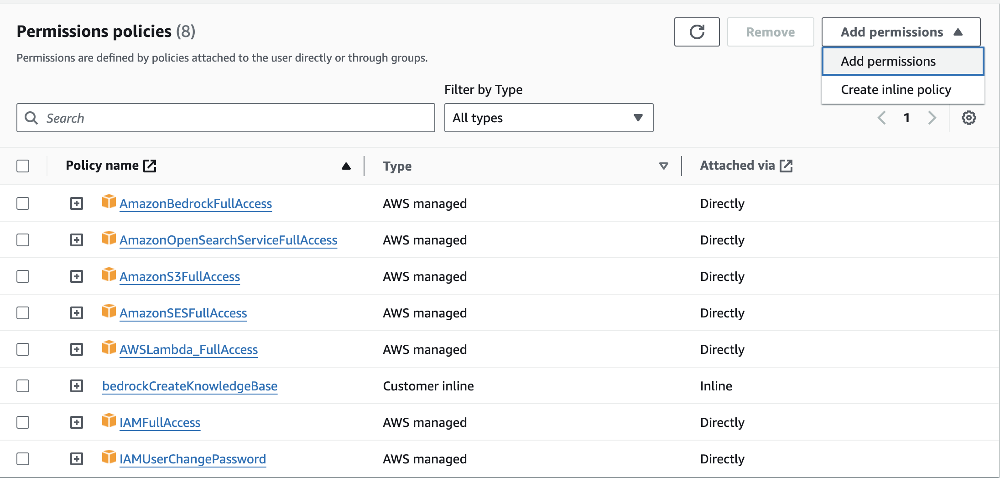

3. **Knowledge base storage configuration provided is invalid...no such index**
   
   And with this error:
   

Read this [medium article](https://aws.plainenglish.io/bedrock-unveiled-indexing-own-data-to-opensearch-serverless-via-a-lambda-3dcdb8a1a4fb) to understand the concept of indexing data to Amazon OpenSearch Service.

- Go to [Amazon OpenSearch Service Serverless](https://us-east-1.console.aws.amazon.com/aos/home?region=us-east-1#opensearch/get-started-serverless)

- Found that there is a collection named `bedrock-knowledge-base-e92hap`
  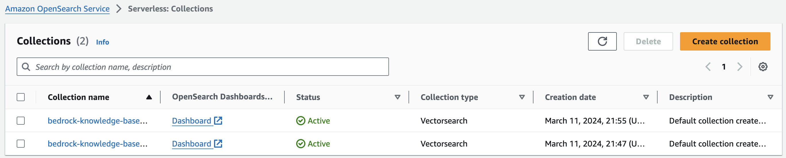

- Also found that some other policy should be added to the user.
  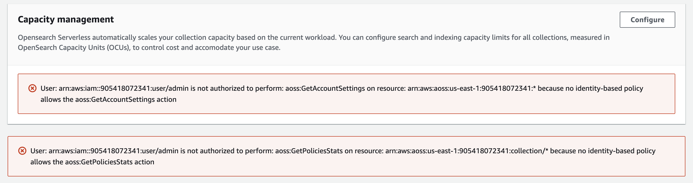

- Try deleting the collection, and found the policy issue.
  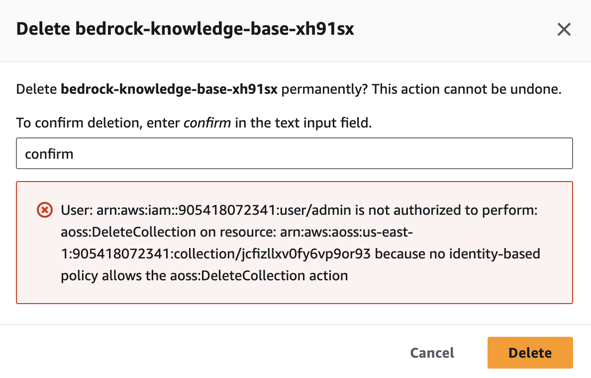

- Go back to root user and add the following policy to the user:

```JSON
{
	"Version": "2012-10-17",
	"Statement": [
		{
			"Sid": "VisualEditor0",
			"Effect": "Allow",
			"Action": [
				"aoss:GetPoliciesStats",
				"aoss:DeleteCollection",
				"aoss:GetAccountSettings"
			],
			"Resource": "*"
		}
	]
}
```

- When trying to open the `OpenSearch Dashboards URL` found that the user has no permission to access the URL.

  ```
  {"status":403,"request-id":"68c3ef72-91f2-9817-8255-bd9c39efeadb","error":{"reason":"403 Forbidden","type":"Forbidden"}}
  ```

  Check IAM Policies: Ensure that the IAM user or role you're using has the necessary permissions to access the OpenSearch Dashboards. You might need to attach a policy that allows aoss:DashboardsAccessAll action.

  ```JSON
  {
    "Effect": "Allow",
    "Action": ["aoss:DashboardsAccessAll"],
    "Resource": "*"
  }
  ```

  After this, the dashboard can be accessed.

However, the error (top of this issue) still exists.

- Go into the collection and found that there is no index in the collection.

    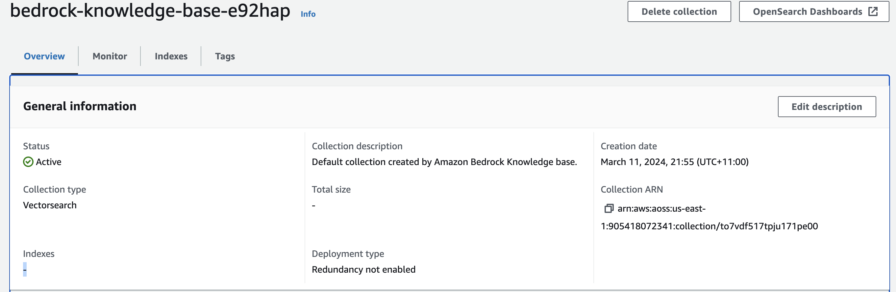

    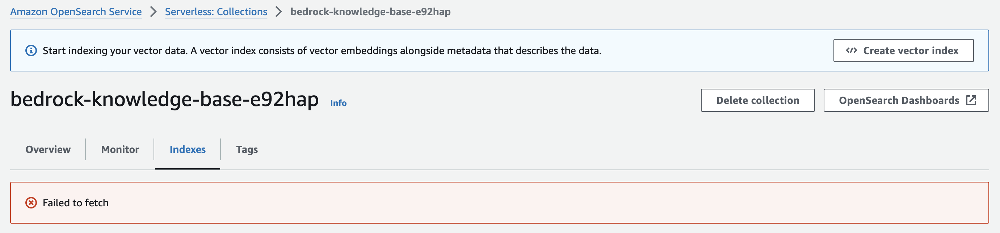

    <p style="color: red; font-weight: bold; font-size: 1.25rem">The bedrock knowledge base setup has created the collection but failed to create the index.</p>

    <h3 style="font-style: italic">This is still an IAM permission issue</h3>

  <span style="font-size: 1.25rem">Solution: </span>Must include `aoss:APIAccessAll` action in the policy.

    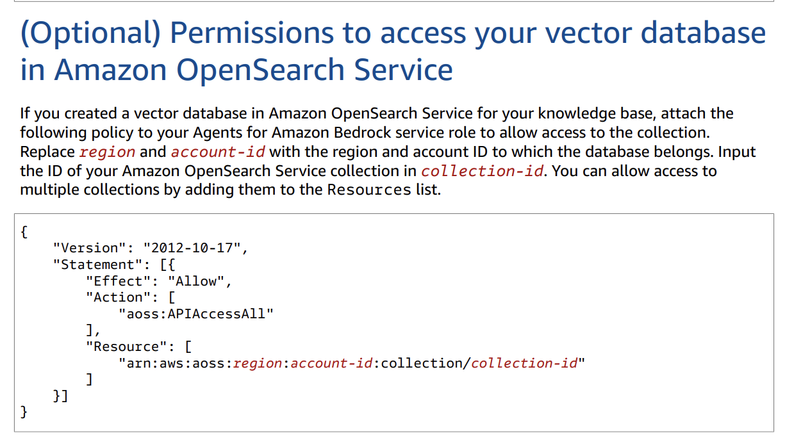

  ```JSON
  {
    "Effect": "Allow",
    "Action": ["aoss:APIAccessAll"],
    "Resource": "*"
  }
  ```

    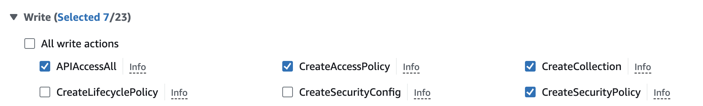

  It is also reported that `AWSMarketplaceFullAccess` may be required.

  The final inline policy attached to the user:

  ```JSON
  {
  	"Version": "2012-10-17",
  	"Statement": [
  		{
  			"Sid": "VisualEditor0",
  			"Effect": "Allow",
  			"Action": [
  				"aoss:BatchGetCollection",
  				"aoss:CreateAccessPolicy",
  				"aoss:GetAccessPolicy",
  				"aoss:CreateSecurityPolicy",
  				"aoss:APIAccessAll",
  				"aoss:ListAccessPolicies",
  				"aoss:ListSecurityPolicies",
  				"aoss:GetPoliciesStats",
  				"aoss:UpdateCollection",
  				"aoss:DashboardsAccessAll",
  				"aoss:DeleteCollection",
  				"aoss:GetAccountSettings",
  				"aoss:ListCollections",
  				"aoss:GetSecurityPolicy",
  				"aoss:CreateCollection"
  			],
  			"Resource": "*"
  		}
  	]
  }
  ```

### Test Knowledge Base

In Test Knowledge Base UI, click "Select model" and choose Claude V2 as response generation model.

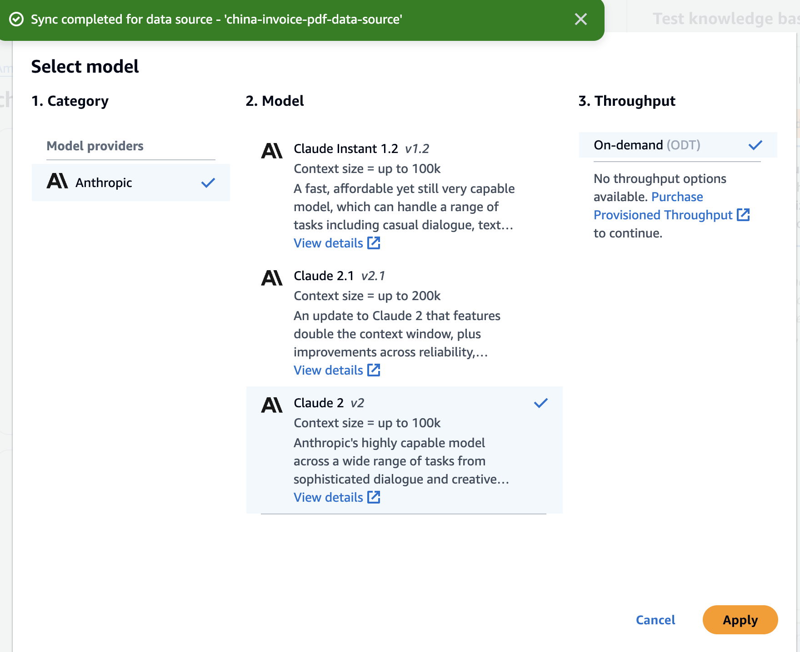

Run any test query and check the response.

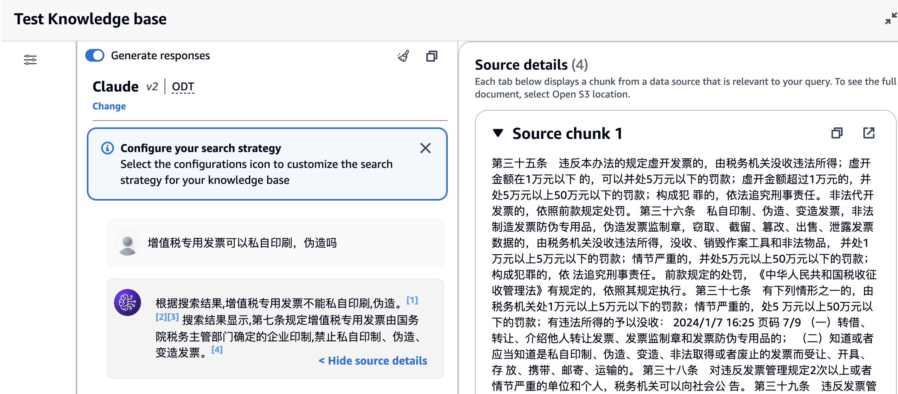

The search strategy can be modified:

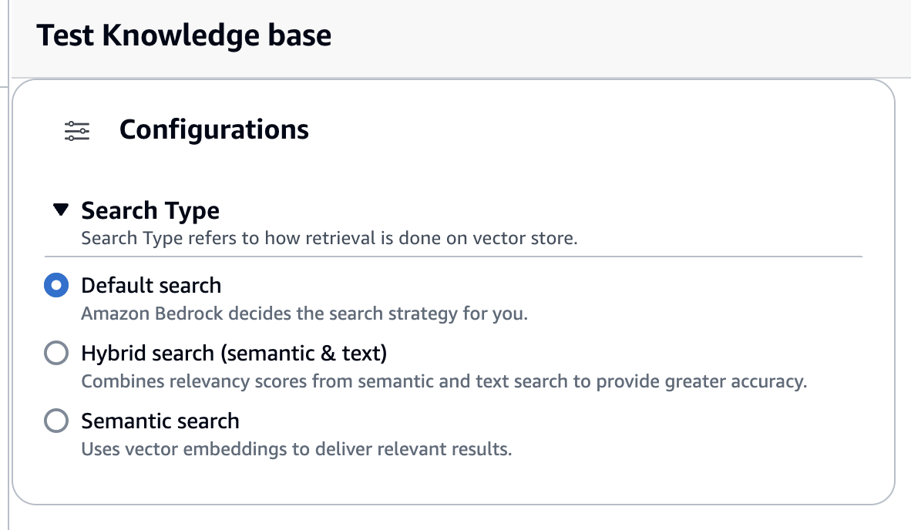
```
