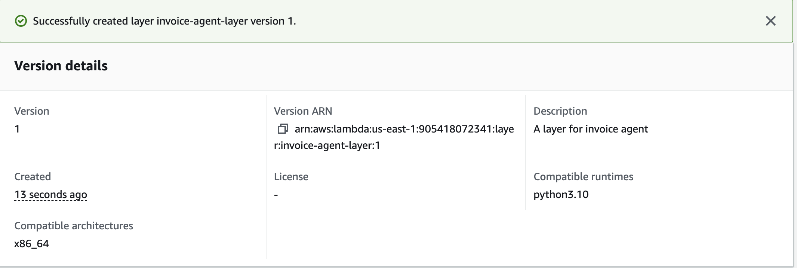
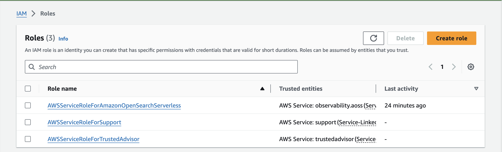
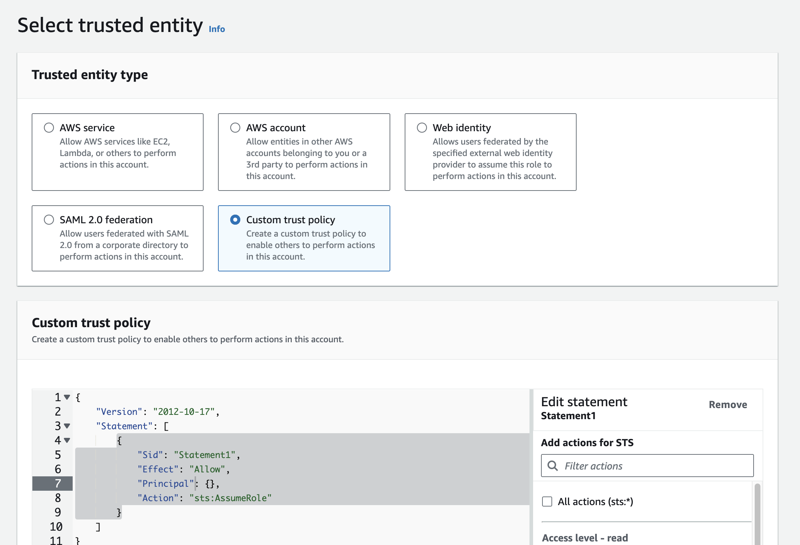
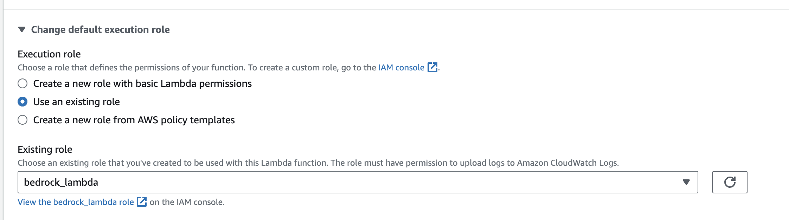
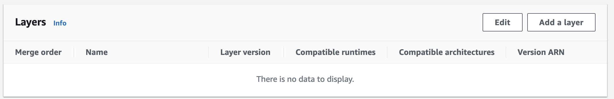
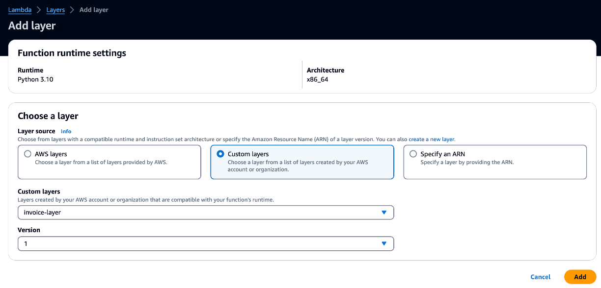
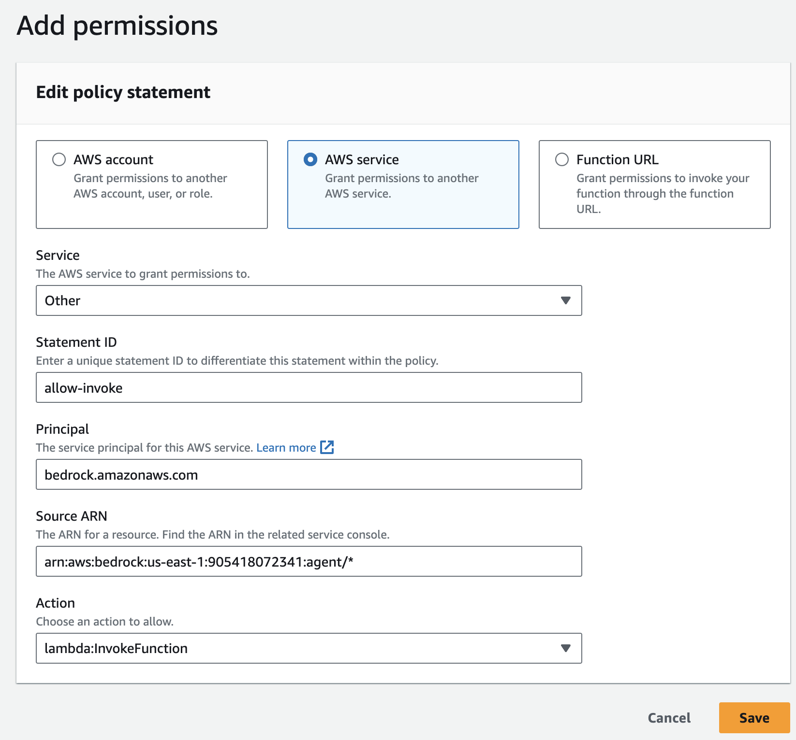

# Workshop [Invoice Agent Implementation Base on AWS Bedrock Agent](https://catalog.us-east-1.prod.workshops.aws/workshops/180cd73a-ccaf-4ade-9e5d-cf964c637638/en-US/0-0-introduction)

## This is part 2 of the workshop

### Create Lambda Function

#### Create a Lambda Layer

- A layer is a package of all the dependencies that your AWS Lambda function needs. These dependencies can be shared across multiple functions.

- use layers to share code across multiple functions or even across multiple AWS accounts.

- AWS provides certain public layers that include the AWS SDK, allowing you to easily use AWS services in your Lambda function.

Go to [lambda layers](https://us-east-1.console.aws.amazon.com/lambda/home?region=us-east-1#/layers)

- Create layer
  - Name: `invoice-agent-layer`
  - Description: `A layer for invoice agent`
  - Upload a file from Amazon S3: `invoice_lambda_layer.zip`
    - Amazon S3 Link URL: `s3://invoice-agent-905418072341/invoice_lambda_layer.zip`
  - Compatible architectures: `x86_64`
  - Compatible runtimes: `Python 3.10`
    

#### Create a Lambda Function

To allow the Lambda service to access all the resources it needs. We need to create a **trust policy** for the Lambda service.

- IAM -> Roles -> [Create role](https://us-east-1.console.aws.amazon.com/iam/home?region=us-east-1#/roles/create)
  
- Choose `Custom trust policy`
  
- Add `"Service": "lambda.amazonaws.com"` to the "Principal"
- Add Permission: `AdministratorAccess` (this is not recommended in production; AdministratorAccess provides full access to AWS services and resources)
- Role name: `bedrock_lambda`
- Create role

##### Create function

Go to `lambda` -> [Create function](https://us-east-1.console.aws.amazon.com/lambda/home?region=us-east-1#/create/function)

- Function name: `invoice-agent-lambda`
- Runtime: `Python 3.10`
- Architecture: `x86_64`
- Change default execution role: `bedrock_lambda`
  
  （you can also change the role later in the `Configuration` tab -> `General configuration` -> `Edit` -> `Execution role`）
- Create function

- Scroll down to the bottom of the function page, and `Add a layer`

  - Custom layers
  - Layer name: `invoice-agent-layer`
  - Version: `1`
  - Add
    
    

- Copy the code from `invoice_agent_lambda.py` and paste it into the function code editor

- Go to `Configuration` -> `Permissions` -> `Resource-based policy statement`
  This allows the bedrock agent to invoke the lambda function

  

  - Add policy
    - Service: `Other`
    - Statement ID: `allow-invoke`
    - Principal: `bedrock.amazonaws.com`
    - Source ARN: `arn:aws:bedrock:us-east-1:905418072341:agent/*` (replace `us-east-1` with your region if it's different; at this point, the agent ARN is not available yet, as you haven't created the agent yet. So make sure to come back and update this later if needed.)
    - Action: `lambda:InvokeFunction`

- Add Lambda function environment variables

  - Go to `Configuration` -> `Environment variables` -> `Edit`

  Need add two variables

  BUCKET_NAME: bucket name of Agent configuration file. ("invoice-agent" in here)
  SENDER: email address which has verified in SES.

  check the `invoice_agent_lambda.py` for more details.

  ```python
  bucket = os.environ.get("BUCKET_NAME")  # Name of bucket with data file and OpenAPI file
  SENDER = os.environ.get("SENDER")
  ```

  - BUCKET_NAME: `invoice-agent-905418072341`
  - SENDER: `your-email-address`

- Deploy the lambda function
  Go to `Code` -> `Deploy`
