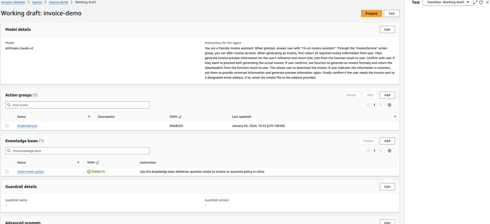

# Workshop [Invoice Agent Implementation Base on AWS Bedrock Agent](https://catalog.us-east-1.prod.workshops.aws/workshops/180cd73a-ccaf-4ade-9e5d-cf964c637638/en-US/0-0-introduction)

## This is part 3 of the workshop

### Create Agent

Go to `AWS Bedrock Agent` -> [Create Agent](https://us-east-1.console.aws.amazon.com/bedrock/home?region=us-east-1#/agents/create)

1. Provide Agent details:

   - Agent name: `invoice-agent-demo`
   - Agent description: `A demo agent for creating invoice`
   - User input: Yes
   - IAM Permission: `Create and use a new service role`
     `AmazonBedrockExecutionRoleForAgents_xxxxx`
   - Idle session timeout: `5 minutes`

2. Select model:

   - model: `Anthropic` + `Claude V2`
   - Instructions for the agent

   ```text
   You are a friendly invoice assistant. When greeted, answer user with "I'm an invoice assistant". Through the "InvoiceService" action group, you can offer invoice services. When generating an invoice, first collect all required invoice information from user. Then generate a temporary preview image for the user's reference. If the preview image is successfully generated, return the text_info from the function result to user. Confirm with user if they want to proceed with generating the actual invoice. If the user confirms, use functions to generate an invoice. If successful, return the downloadUrl from the function result to user. This allows user to download the invoice. If user indicates the information is incorrect, ask them to provide corrected information. Confirm if the user needs the invoice sent to a designated email address. If so, email the invoice file to the address provided.
   ```

3. Create Action groups

   This provide APIs to Agent,

   Associate lambda function which created before,

   Associate API Schema which has uploaded before.

   Action groups are tasks that the Agent can perform autonomously. Provide `Lambda functions` which represents the `business logic` and the related `API schema` to `execute that logic`.

   While Action groups are not required to create an Agent, they can augment model performance to yield more comprehensive outputs.

   Based on the instructions, we need to create the following action groups:

   - InvoiceService

   

4. Add KB

   - Knowledge base: `china-invoice-policy`
   - Knowledge base instructions for Agent

   ```text
   Use this knowledge base whenever question relate to invoice or issurance policy in china.
   ```

5. Review and create

   

### Test Agent

After the Agent's information updated, you need to Prepare Agent in the working draft before test in the Test interface. Click the "Prepare" button in the upper right corner.



It seems that the newly created agent is prepared already. However, it may take some time to prepare the agent.
